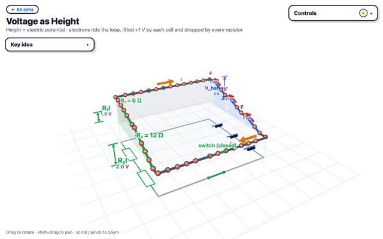
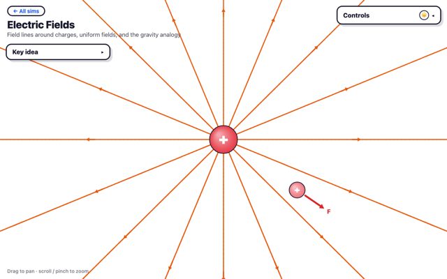
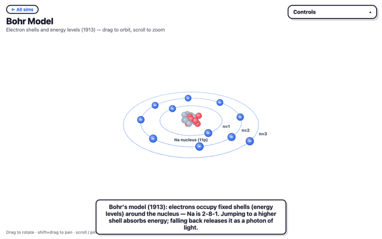
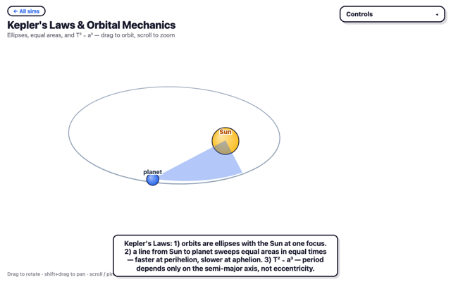
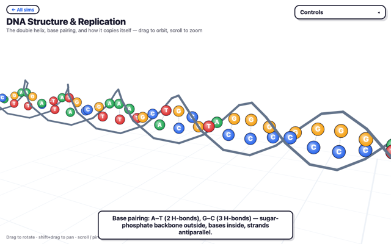
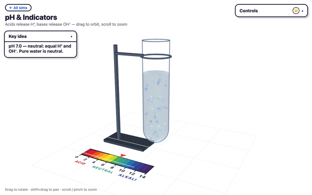

# Simulation Zoo

Interactive **3D physics, chemistry & biology** simulations for the classroom — built to make the hard-to-picture ideas of high-school science visible and playable.

**▶ Live hub: https://hamishhuggard.github.io/sims/**

Every sim is 3D and light-mode (projector-friendly): drag to orbit, shift+drag to pan, scroll/pinch to zoom. Every visual layer has a show/hide toggle, and a footer states the key equation or idea in big type. Nothing auto-advances — they're teacher- and student-driven exploration tools, not videos.

| | | |
|:---:|:---:|:---:|
| [](electromagnetism/voltage-hill.html)<br>**Voltage as Height** | [](electromagnetism/electric-field.html)<br>**Electric Fields** | [](atomic-structure/bohr-model.html)<br>**Bohr Model** |
| [](astronomy/kepler-orbits.html)<br>**Kepler's Laws** | [](genetics/dna-structure.html)<br>**DNA Structure** | [](chemistry/ph-scale.html)<br>**pH & Indicators** |

## Running it

There's no build step. It's plain HTML + vanilla JS on a shared `lib/engine3d.js` renderer and `lib/ui.js` control panel. Open `index.html` directly, or serve the folder:

```bash
python3 -m http.server 8000   # then open http://localhost:8000
```

## All simulations

### Physics

**Electricity & Magnetism**
- [Electric Fields](electromagnetism/electric-field.html) — field lines around charges, and the gravity analogy.
- [Voltage as Height](electromagnetism/voltage-hill.html) — charges ride a hill; cells lift them, resistors drop them; open the switch and watch the voltage move.
- [Magnetic Fields](electromagnetism/magnetic-field.html) — bar magnets, wires and solenoids: where do the field lines go?
- [DC Motor](electromagnetism/motor.html) — F = BIL and the right-hand slap rule, in 3D.
- [Charge in a Magnetic Field](electromagnetism/charge-in-field.html) — why moving charges curve into circles.
- [Induction & Generators](electromagnetism/induction.html) — rod on rails, AC vs DC generators, and Lenz's law.
- [Inverse Square Law](electromagnetism/inverse-square.html) — a fixed detector catches a shrinking share as distance grows: rate ∝ 1/r².

**Atomic & Nuclear Physics**
- [Plum Pudding Model](atomic-structure/plum-pudding-model.html) — Thomson's atom: electrons embedded in a ball of positive charge.
- [Rutherford Experiment](atomic-structure/rutherford-experiment.html) — the gold foil experiment: why we believe in a tiny, dense nucleus.
- [Rutherford Model](atomic-structure/rutherford-model.html) — the planetary atom, and why it couldn't actually work.
- [Bohr Model](atomic-structure/bohr-model.html) — electron shells, energy levels, and photons on jumping.
- [Radioactive Decay](nuclear-physics/radioactive-decay.html) — stochastic decay per nucleus vs the theoretical half-life curve.
- [Isotopes & the Band of Stability](nuclear-physics/isotopes.html) — protons vs neutrons, and why some nuclides are stable.
- [Fission & Fusion](nuclear-physics/fission-fusion.html) — split a U-235 chain reaction, or push D+T together to fuse.
- [Ionising Radiation & Safety](nuclear-physics/radiation-safety.html) — α, β, γ penetrating power through paper, aluminium and lead.

**Forces & Motion**
- [Newton's Three Laws](forces-and-motion/newtons-laws.html) — inertia, F = ma, and action-reaction, side by side.
- [Projectile Motion](forces-and-motion/projectile-motion.html) — horizontal & vertical motion are independent: why the path is a parabola.
- [Momentum & Collisions](forces-and-motion/momentum-collisions.html) — elastic vs inelastic carts: momentum always conserved, energy not always.
- [Circular Motion](forces-and-motion/circular-motion.html) — F꜀ = mv²/r, and what really happens when the string breaks.

**Waves**
- [Wave Properties](waves/wave-properties.html) — transverse vs longitudinal, and why v = fλ.
- [Superposition & Interference](waves/superposition-interference.html) — two pulses meet, add, and pass through each other unaffected.
- [Standing Waves & Resonance](waves/standing-waves-resonance.html) — why only certain driving frequencies make the string swell.
- [The Doppler Effect](waves/doppler-effect.html) — the source's frequency never changes, only what you hear does.

**Optics**
- [Reflection & Refraction](optics/reflection-refraction.html) — Snell's law, and why total internal reflection only goes one way.
- [Lenses & Ray Diagrams](optics/lenses.html) — converging vs diverging: real, virtual, upright, inverted.
- [Total Internal Reflection & Fibre Optics](optics/total-internal-reflection.html) — why light stays trapped inside a bent fibre, until it doesn't.
- [Diffraction & Interference of Light](optics/diffraction-interference.html) — single-slit vs Young's double-slit, the same wave principle, live.

**Astronomy**
- [The Solar System](astronomy/solar-system-model.html) — why you can never see true sizes and true distances at the same time.
- [Retrograde Motion of Mars](astronomy/retrograde-motion.html) — Earth overtaking Mars on the inside track: an illusion, not a reversal.
- [Phases of the Moon](astronomy/moon-phases.html) — half the Moon is always lit; phases are changing angles, not shadows.
- [The Seasons](astronomy/seasons.html) — axial tilt, not distance from the Sun, drives the seasons.
- [Solar & Lunar Eclipses](astronomy/eclipses.html) — the Moon's ~5° tilted orbit is why eclipses aren't monthly.
- [Kepler's Laws & Orbital Mechanics](astronomy/kepler-orbits.html) — ellipses, equal areas in equal times, and why T² ∝ a³.
- [Stellar Evolution & the H-R Diagram](astronomy/hr-diagram.html) — mass alone decides a star's lifetime and how it ends.

### Biology

**Genetics**
- [DNA Structure & Replication](genetics/dna-structure.html) — the double helix, base pairing, and semi-conservative replication.
- [Meiosis & Inheritance](genetics/meiosis.html) — one diploid cell to four haploid gametes: crossing over & independent assortment.
- [Punnett Squares & Genetic Crosses](genetics/punnett-squares.html) — monohybrid and dihybrid crosses, with live ratios.
- [Natural Selection & Evolution](genetics/natural-selection.html) — birds eat the bugs that stand out; camouflage selection shifts the population.

### Chemistry

**Acids & Bases**
- [pH & Indicators](chemistry/ph-scale.html) — why does the pH scale go red to purple?
- [Neutralisation (Titration)](chemistry/neutralisation.html) — watch the pH curve jump at the equivalence point.
- [Reactions of Acids](chemistry/acid-reactions.html) — metals, carbonates and bases: what gas comes off?
- [Combustion](chemistry/combustion.html) — why does a smoky yellow flame mean wasted fuel?
